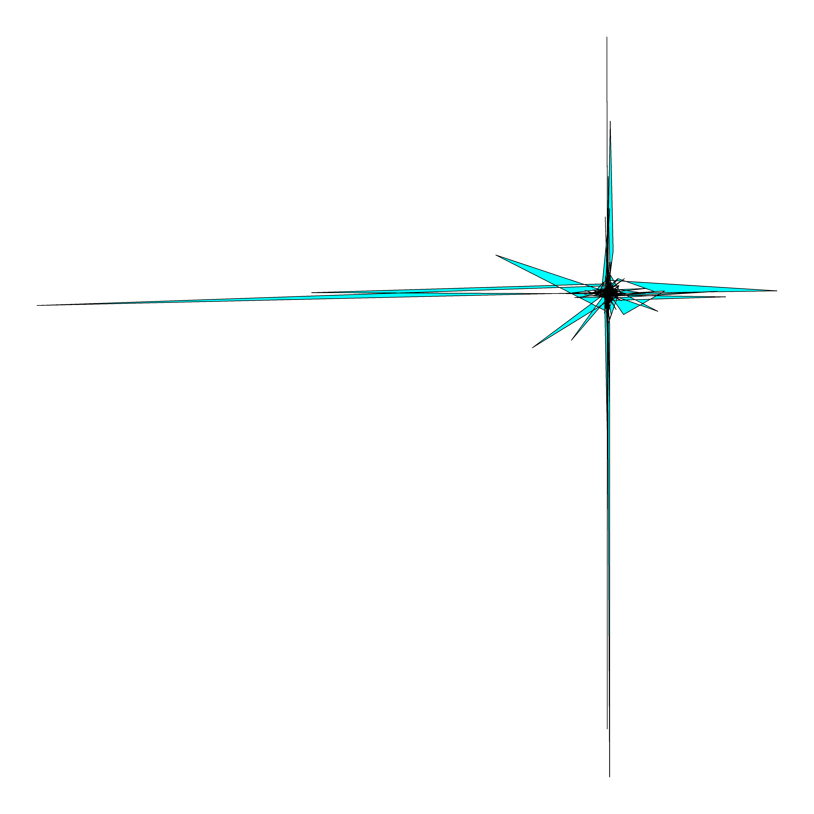

<!-- README.md is generated from README.Rmd. Please edit that file -->

# Voronoise

<!-- badges: start -->

<!-- badges: end -->

This is basically a clone of [djnavarro/voronoise](https://github.com/djnavarro/voronoise) and merged with few other packages from her.
I've been experimenting with new distributional sampling, using `dqsample::sample` etc.. as a way of
teaching myself some R.(I'm a pythonista and data scientist, so need to learn it.)

You can install the development version of voronoise from GitHub with:


``` r
remotes::install_github("nandhinianandj/voronoise")
```

## Example

Okay since I've done something of a [general
mish-mash](https://hitchhikers.fandom.com/wiki/Whole_Sort_of_General_Mish_Mash) of a few of her
packages. Not nearly enough general or enough whole, but I'm hoping to expand to outside of her work
too.

Anyways, for now if you want to go deeper, I suggest you start with the original [README here](https://github.com/djnavarro/voronoise).
I'm going to skip that part and jump to my experiments so far.


My new attempts and an example of style_overlay:
```r
options(scipen=999)  # turn off scientific notation like 1e+06
library(ggplot2)
library(voronoise)
library(stringr)

# Init Ggplot

circle <- voronoise::entity_circle()
heart <- voronoise::entity_heart()

beta <- voronoise::entity_beta(grain=5000, shape1=1.1, shape2=1.2)
cauchy <- voronoise::entity_cauchy(grain=5000, location=0.4, scale=08)
hypergeom <- voronoise::entity_hypergeometric(grain=5000, m=120, n=380, k=10)
weibull <- voronoise::entity_weibull(grain=5000, shape=1, scale=1)

createpic <- function (dtype) {
	p <- ggplot() +  theme_void() +
	     geom_text(aes(0,0,label='N/A')) +
	     xlab(NULL)

	today <- as.character(Sys.Date())
	time <- as.character(Sys.time())

	if (dtype == 'beta') {
		p <- voronoise::style_overlay(p, border="black", fill="cyan", data=beta)
		fname <- str_c('beta_dist_', today, time, '.png')
	} else if (dtype == 'cauchy') {
		p <- voronoise::style_overlay(p, border="black", fill="cyan", data=cauchy)
		fname <- str_c('cauchy_dist_', today, time, '.png')
	} else if (dtype == 'hypergeom') {
		p <- voronoise::style_overlay(p, border="black", fill="cyan", data=hypergeom)
		fname <- str_c('hypergeometry_dist_', today, time, '.png')
	} else {
		p <- voronoise::style_overlay(p, border="black", fill="cyan", data=weibull)
		fname <- str_c('weibull_dist_', today, time, '.png')
	}

	# save the file
	ggplot2::ggsave(
	  filename = str_c("creations/", fname),
	  plot = p,
	  device = "png",
	  width = 100/3,
	  height = 100/3,
	  dpi = 150
	)

}

createpic('weibull')
createpic('hypergeom')
createpic('beta')
createpic('cauchy')

```





